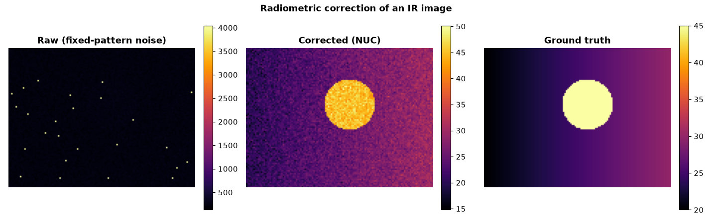

# Projet 3 — Correction radiométrique de capteurs infrarouges (NUC)

> **Stack :** Python · NumPy · régression linéaire · interpolation polynomiale (Newton) · matplotlib
> *Inspiré du Lynred Data Challenge.*

Les détecteurs infrarouges souffrent de **bruit de motif fixe** (*Fixed Pattern
Noise*) : chaque pixel a sa propre réponse (gain) et son propre offset. Une scène
parfaitement uniforme apparaît donc granuleuse. Ce projet **corrige la
non-uniformité (NUC)** pour révéler la température réelle de la scène, à partir
d'un jeu de calibration multi-températures — y compris lorsque **certaines
calibrations sont manquantes**.

## 🎯 Objectif & résultat

| Objectif | Résultat mesuré |
|----------|-----------------|
| Reconstruire une calibration manquante | ✅ Newton (degré 3) — **PSNR ~65 dB** |
| Corriger le bruit de motif fixe | ✅ non-uniformité **71 % → 4,7 %** (~15×) |
| Restaurer la température de scène | ✅ PSNR **−21 dB → +23 dB** |
| Gérer les pixels défectueux | ✅ détection robuste (MAD) + réparation |



## 🔬 Méthode

1. **Modèle physique par pixel** (régime linéaire) :
   `raw[i,j] = gain[i,j] · T + offset[i,j] + bruit`
2. **Calibration** — régression linéaire par pixel sur plusieurs températures
   corps noir ⇒ cartes de **responsivité** et d'**offset** (`correction.py`).
3. **Interpolation de Newton (degré 3)** — reconstruit un jeu de calibration
   manquant/corrompu à partir des températures voisines, en version vectorisée
   sur toute l'image (`newton.py`).
4. **Correction** — inversion du modèle : `T̂ = (raw − offset) / responsivité`.
5. **Pixels aberrants** — détection par seuil MAD robuste, réparation par médiane
   locale 3×3.
6. **Évaluation** — PSNR + non-uniformité (`metrics.py`). *BRISQUE* est la
   métrique perceptuelle de référence du challenge ; on utilise ici PSNR + NU%,
   reproductibles sans modèle pré-entraîné.

## 🚀 Utilisation

```bash
pip install -r requirements.txt
python run.py                 # démo complète + figures/ + métriques
python -m pytest tests/ -q    # 6 tests (Newton exact, calibration, PSNR, MAD)
```

### Sortie type
```
Newton reconstruction of missing 30 °C calibration frame:
  PSNR 65.4 dB | RMSE 2.10 counts
Image correction (vs ground-truth temperature):
  PSNR raw -20.7 dB -> corrected 23.4 dB
Non-uniformity on a uniform 35 °C image:
  NU raw 71.21% -> corrected 4.75% (15x reduction)
```

## 🧠 Points techniques
- **Interpolation de Newton vectorisée** (différences divisées) : exacte sur un
  cubique (testé à la précision machine), appliquée frame par frame.
- **Régression par pixel entièrement vectorisée** (pas de boucle sur les pixels).
- **Robustesse** : détection MAD des pixels morts/chauds + réparation locale.
- **Démarche méthodologique** : modèle physique explicite, hypothèses testables,
  métriques quantitatives avant/après.
