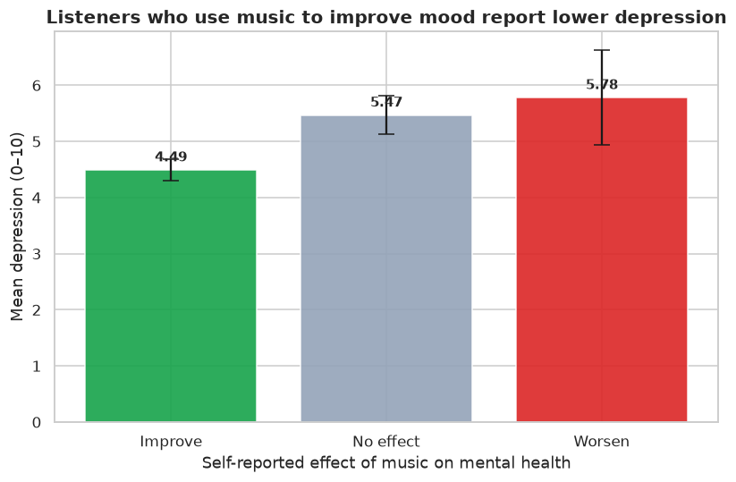
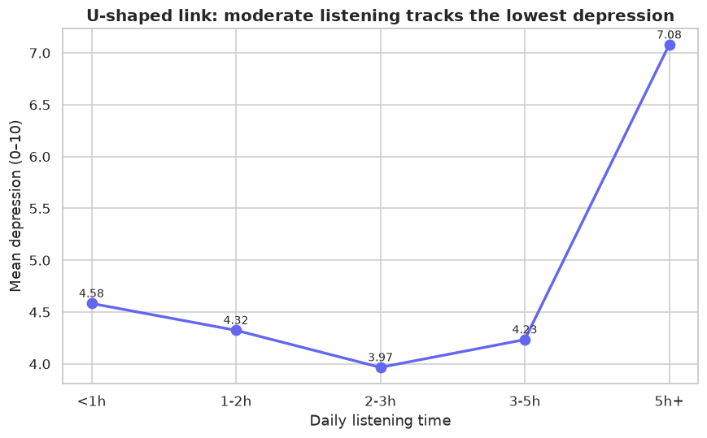
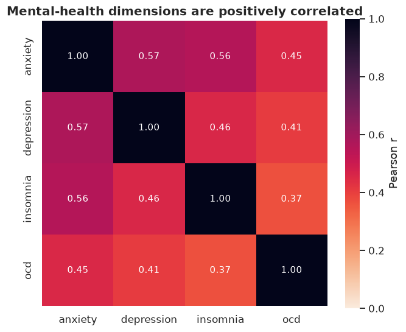
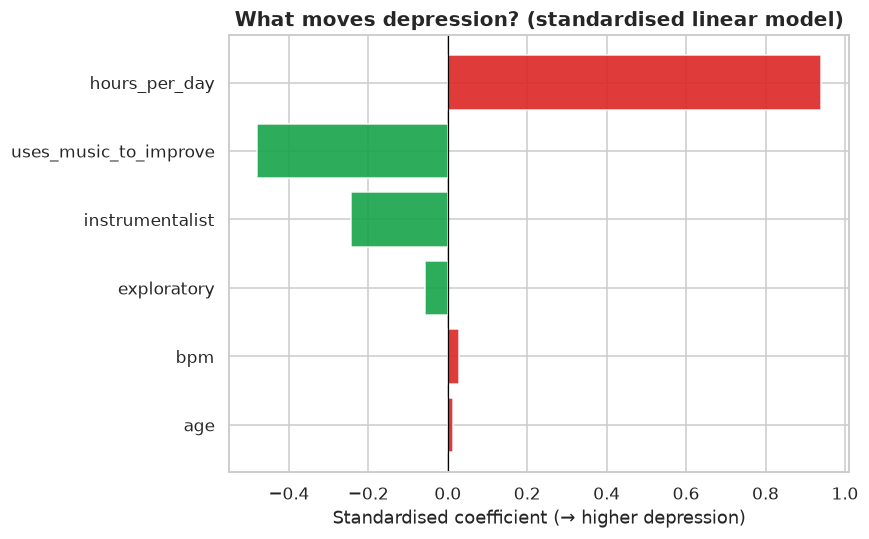

# Projet 4 — Musique & Dépression (science cognitive)

> **Stack :** Python · pandas · SciPy · scikit-learn · seaborn · pytest · CI

Analyse comportementale du lien entre **habitudes d'écoute musicale** et
**dépression auto-déclarée**, à partir d'un questionnaire de type
*MxMH (Music × Mental Health)*. L'accent est mis sur la **rigueur statistique** —
tests d'hypothèses, **tailles d'effet** et **intervalles de confiance** — pas
seulement des p-values.

> ⚠️ Données **synthétiques** générées à partir de relations issues de la
> littérature sur la régulation de l'humeur. L'étude est **observationnelle** :
> on parle d'**associations**, pas de causalité.

## 🧠 Question de recherche

La musique est un outil courant de **régulation de l'humeur**. Trois hypothèses
inspirées de la science cognitive sont testées :

1. Utiliser la musique pour **améliorer son humeur** est associé à une dépression plus faible.
2. Le **temps d'écoute** suit une relation en **U** (trop peu / trop = moins bon).
3. Anxiété, dépression et insomnie **co-occurrent** (comorbidité).

## 📊 Résultats clés

### 1. La musique comme régulateur d'humeur → dépression plus faible
ANOVA à un facteur : **F = 14,5, p < 10⁻⁶**. Le groupe « Improve » score en
moyenne **~1 point de moins** que « No effect » (Welch t = −4,8, p < 10⁻⁵,
**Cohen's d = −0,42**, effet petit-à-moyen).



### 2. Relation en U avec le temps d'écoute
La dépression est **minimale autour de 2–3 h/jour** et remonte nettement au-delà
de 5 h (escapisme / rumination). Une simple corrélation linéaire (r ≈ 0,40)
**masque cette forme en U**.



### 3. Comorbidité
Anxiété ↔ dépression **r ≈ 0,56** ; les dimensions de santé mentale sont
positivement corrélées.



### 4. Drivers standardisés
Modèle linéaire (coefficients standardisés) : le **temps d'écoute** et le fait
d'**utiliser la musique pour aller mieux** ressortent comme les facteurs les plus
associés à la dépression, dans les directions attendues.



## 🔬 Méthodes statistiques (`src/stats.py`, testées)
- **Welch t-test** (variances inégales) + **Cohen's d** (taille d'effet).
- **ANOVA** à un facteur pour la comparaison multi-groupes.
- **Corrélation de Pearson** (avec p-value).
- **Intervalles de confiance par bootstrap** (percentile, 5 000 rééchantillonnages).
- **Régression linéaire standardisée** pour hiérarchiser les facteurs.

## 🚀 Utilisation

```bash
pip install -r requirements.txt

python data/generate_data.py   # questionnaire synthétique -> data/survey.csv
python src/analysis.py         # rapport statistique + figures/
python -m pytest tests/ -q     # 7 tests (toolkit stats + smoke test pipeline)
```

## 📁 Structure
```
04-music-and-depression/
├── data/generate_data.py   # questionnaire MxMH-style (736 répondants)
├── src/
│   ├── stats.py            # toolkit statistique (testé unitairement)
│   └── analysis.py         # EDA + tests + figures
├── figures/                # graphiques exportés
└── tests/test_stats.py     # 7 tests
```
